# **Apple Shop**  

[

A Flutter application with a completely Cupertino design  
(In this project, only the UI is designed)      
## ✨ Features

- [x] Dark Mode
- [x] Cupertino Design

## 📸 ScreenShots

| Light                             | Dark                              |
| --------------------------------- | --------------------------------- |
| 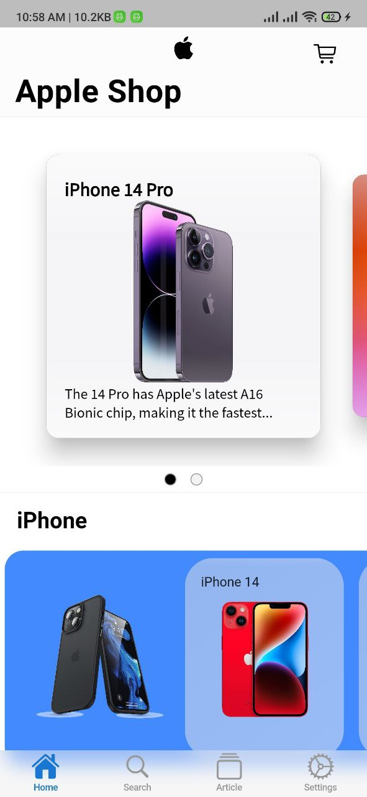  | 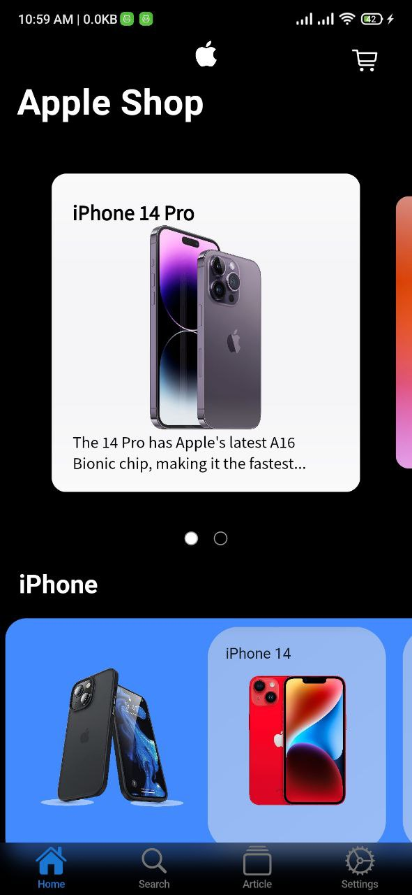  |
| 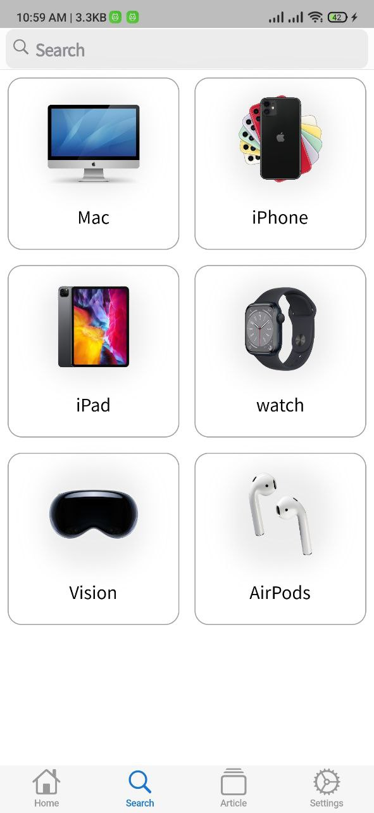  | 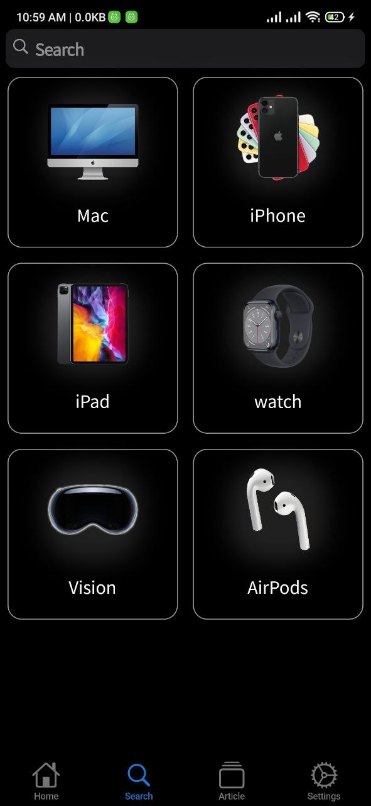  |
| 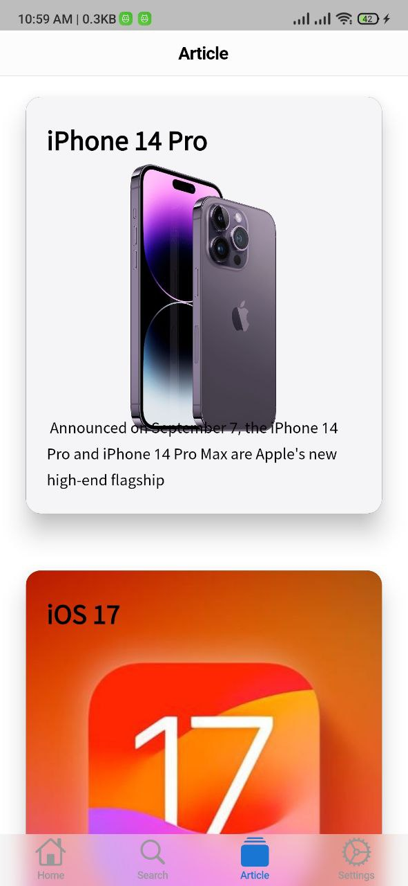  | 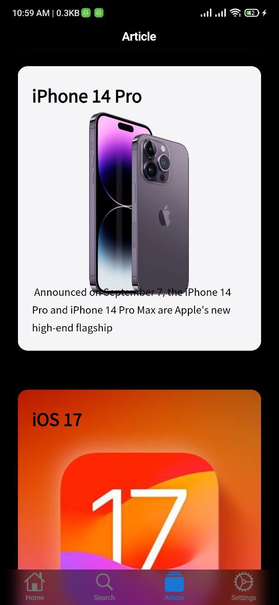  |
| 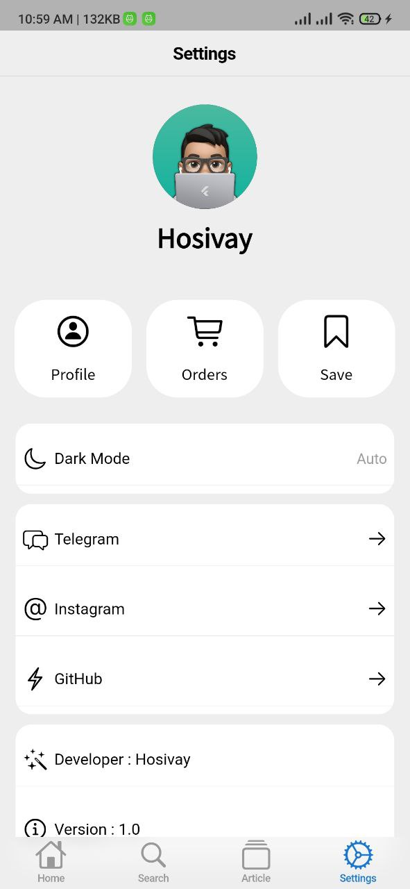  | 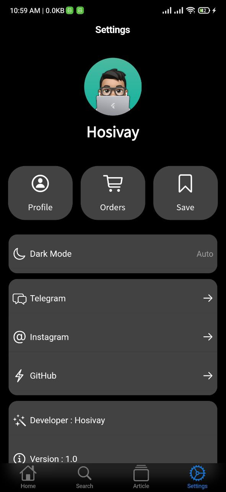  |
| 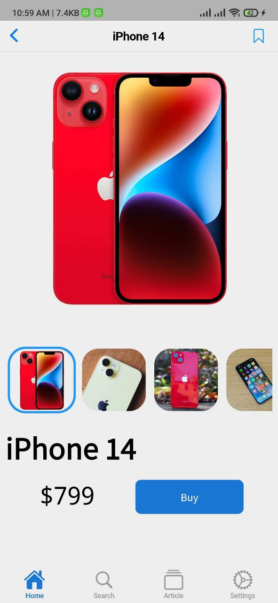  | 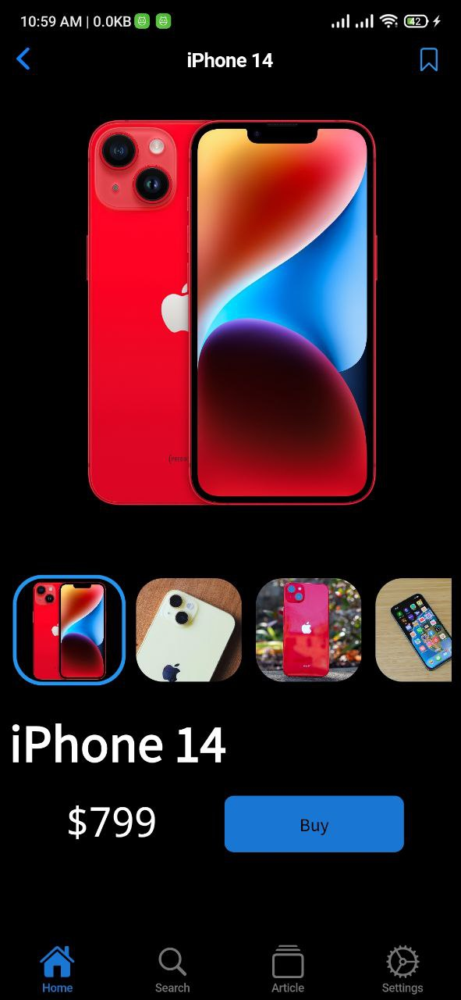  |
| 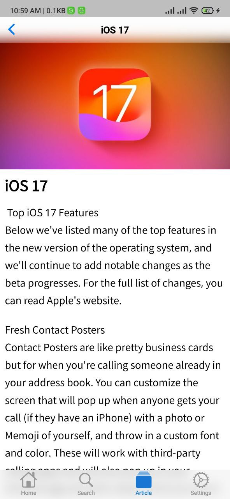  | 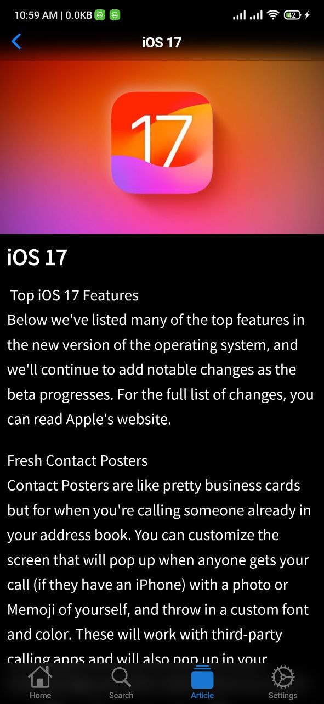  |

## 🔌 Plugins

| Name                                                                   |
| ---------------------------------------------------------------------- |
| [**carousel_slider**](https://pub.dev/packages/carousel_slider)        |
| [**flutter_bounceable**](https://pub.dev/packages/flutter_bounceable)  |
| [**animate_do**](https://pub.dev/packages/animate_do)                  |

 # <em>Version : 1.0 <em/> 
